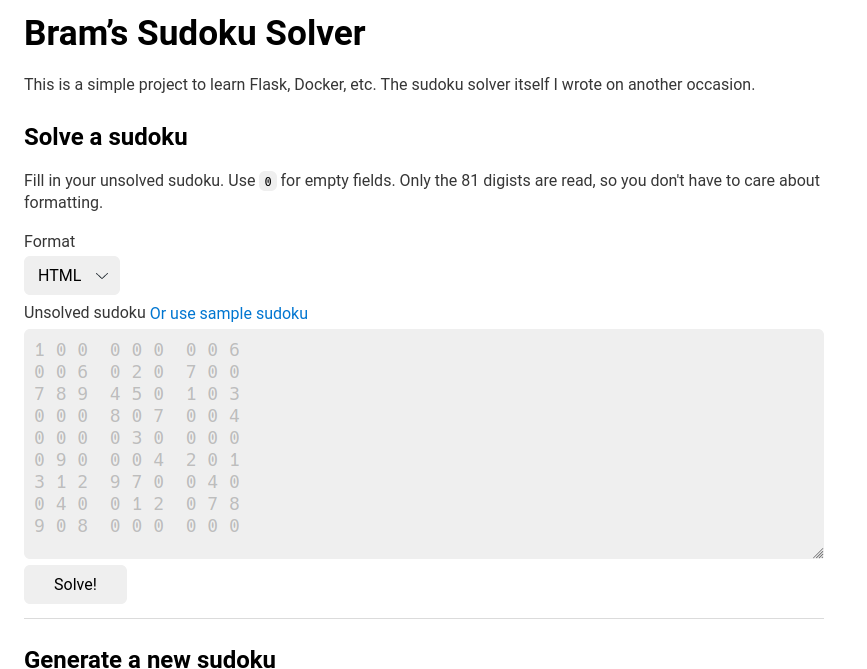

# Bram’s Sudoku Solver

This is a simple project to learn Flask, Docker, etc. I wrote the [sudoku
solver](https://github.com/brmdv/sudoku-solvers) itself on another occasion.

You can see it working on Heroku at <https://brams-sudoku-solver.herokuapp.com/>.

